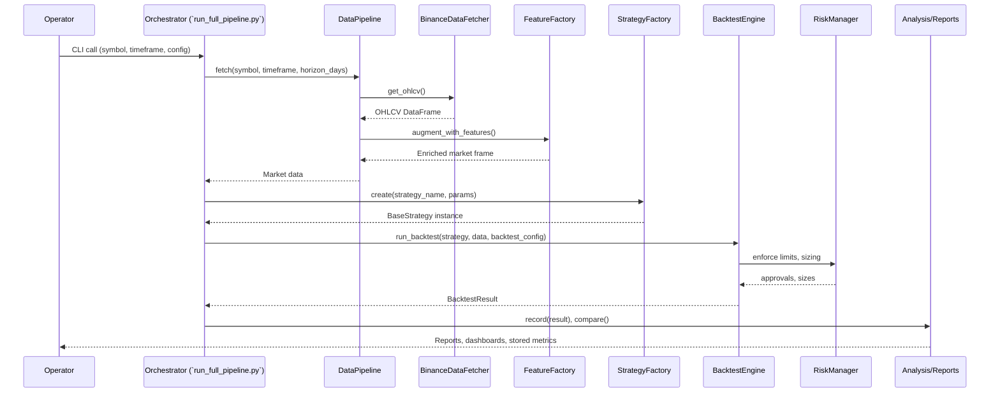

# Crypto Trading Platform Architecture

## Context & Scope
- This repository contains a modular crypto trading research platform composed of the core engine (`src/crypto_trader`), a Streamlit comparison UI (`src/crypto_strategy_comparison`), automation scripts (for example `run_full_pipeline.py`), and a pile of operational reports/logs.
- The codebase targets three primary personas: research engineers iterating on strategies, risk/ops staff validating production readiness, and stakeholders consuming dashboards or generated reports.
- All components are pure Python, orchestrated via Typer CLI, Streamlit, and batch scripts; persistent state lives in CSV stores under `data/`.

## Component Map
- Interfaces hand commands to orchestration, which coordinates market data, feature enrichment, strategy execution, risk controls, analytics, and reporting.
- Supporting services (feature store, performance store, cache, config) sit alongside to keep the main flow stateless.

```mermaid
graph TD
    subgraph Interfaces
        CLI[Typer CLI\n`src/crypto_trader/cli`] --> Orch
        Dashboard[Streamlit Dashboard\n`src/crypto_strategy_comparison/app.py`] --> Orch
        Scripts[`run_full_pipeline.py`\n`run_dashboard.sh`] --> Orch
        Notebooks[`notebooks/` research] --> Orch
    end
    Orch[Orchestration Layer\n`run_full_pipeline.py`\n`src/crypto_trader/orchestration`](Orchestration) --> Data
    Orch --> Strat
    Orch --> Backtest
    Orch --> Reports
    Data[Market Data & Features\n`src/crypto_trader/data`\n`src/crypto_trader/features`] --> Cache[Storage & Cache\n`data/ohlcv`\n`data/features`]
    Data --> FeatureStore
    FeatureStore[FeatureStore\nCSV pillars] --> Data
    Strat[Strategy Platform\n`src/crypto_trader/strategies`\n`src/crypto_trader/factories`] --> Backtest
    Backtest[Backtesting & Risk\n`src/crypto_trader/backtesting`\n`src/crypto_trader/risk`] --> Analytics[Analytics\n`src/crypto_trader/analysis`]
    Analytics --> Reports[Reports & Distribution\n`src/crypto_trader/reports`\nStreamlit]
    Backtest --> Exec[Execution Hooks\n`src/crypto_trader/execution`]
```

## End-to-End Flow


## Subsystem Details

### Interfaces & Orchestration
- **CLI (`src/crypto_trader/cli/app.py`)**: Typer-based command surface with grouped commands (`data`, `strategy`, `backtest`). Each subcommand defers to command modules under `src/crypto_trader/cli/commands`.
- **Automation scripts (`run_full_pipeline.py`, `run_dashboard.sh`, numerous `master_*.py`)**: Batch execution harnesses combining fetch → backtest → reporting for single-pair, multi-pair, and windowed workflows. These scripts stitch together data fetchers, strategy factory, backtesting engine, and analyzers.
- **Streamlit dashboard (`src/crypto_strategy_comparison/app.py`)**: Real-time comparison UI driven by `ComparisonEngine` and `StrategyLoader` in the same package, backed by outputs from the analysis layer.
- **Config management (`src/crypto_trader/core/config.py`)**: Pydantic settings hierarchy (`DataConfig`, `StrategyConfig`, `BacktestConfig`, `RiskConfig`, aggregated under `TradingConfig`) with YAML serialization helpers for reproducible runs.

### Market Data & Feature Platform
- **Fetchers (`src/crypto_trader/data/fetchers.py`)**: `BinanceDataFetcher` wraps CCXT with rate limiting, retries, CSV persistence (`OHLCVStorage`), and optional in-memory cache (`OHLCVCache`).
- **Providers (`src/crypto_trader/data/providers.py`)**: `DataProvider` abstract class defines `get_ohlcv`, `update_data`, `get_available_symbols`, and validation hooks; `MockDataProvider` supplies synthetic frames for tests.
- **Pipeline (`src/crypto_trader/data/pipeline.py`)**: `DataPipeline.fetch`/`fetch_multi` orchestrate fetch → feature augmentation → caching, with warm-up windows and staleness-aware joins via the feature factory.
- **Feature store (`src/crypto_trader/features/store.py`)**: Lightweight CSV-based `FeatureStore` and `FeatureReadRequest` with per-pillar directories under `data/features`.
- **Feature factory (`src/crypto_trader/features/factory.py`)**: `augment_with_features` forward-fills pillar frames, applies staleness masks, and namespaced columns (`pillar.metric`). `FeatureJoinConfig` controls pillars and freshness.
- **Alternative data (`src/crypto_trader/data/alt/`)**: Houses ingestion utilities for on-chain, sentiment, and micro-structure sources to populate the feature store.

### Strategy Platform
- **Base contract (`src/crypto_trader/strategies/base.py`)**: `BaseStrategy` enforces `initialize`, `generate_signals`, `get_parameters`, plus validation helpers for OHLCV coverage and indicator requirements.
- **Registry (`src/crypto_trader/strategies/registry.py`)**: Thread-safe `StrategyRegistry` with decorator-based registration, discovery utilities, and metadata tagging (docstrings, tags).
- **Loader (`src/crypto_trader/strategies/loader.py`)**: Parses YAML configs into validated `StrategyConfig` models, instantiates strategies via registry.
- **Factory (`src/crypto_trader/factories/strategy_factory.py`)**: Central creation entry point with optional config validation and lifecycle hooks; `create_batch` handles ensembles.
- **Library & mixins (`src/crypto_trader/strategies/library/`, `src/crypto_trader/strategies/mixins/`)**: Concrete strategies (SMA, RSI, Bollinger, stat-arb, etc.) and reusable components (indicator mixins, risk filters).

### Backtesting & Risk
- **Backtesting engine (`src/crypto_trader/backtesting/engine.py`)**: Wraps VectorBT to translate strategy signals into portfolios, compute metrics (`PerformanceMetrics`), and emit `BacktestResult`.
- **Supporting modules**: `executor.py`, `portfolio.py`, `metrics.py`, `result_store.py` (if present) manage order execution, cash sharing, and persistence; `master_*` scripts orchestrate cross-window runs.
- **Risk layer (`src/crypto_trader/risk/`)**: `RiskManager` combines `PositionSizer`, `RiskLimitChecker`, stop-loss/take-profit math, and drawdown tracking. Configured via `RiskConfig` and used both during backtests and live hooks.
- **Orchestration (`src/crypto_trader/orchestration/*`)**: `TrainTestSplitter`, `WindowSpec`, and multi-pair window managers enforce temporal splits and deterministic evaluation windows.

### Analytics, Reporting, and Distribution
- **Analysis (`src/crypto_trader/analysis/`)**: `ResultsAggregator`, `StrategyComparison`, `multipair_aggregator`, `windowed_cache` compute rolling stats, cross-strategy comparisons, and caching for dashboard use.
- **Performance store (`src/crypto_trader/analysis/performance_store.py`)**: CSV-backed historical metrics powering dynamic ensembles and dashboard recency views.
- **Report generation (`src/crypto_trader/reports/`)**: Formatters, HTML/PDF templates, and generators produce narrative reports consumed by ops and Streamlit UI. Many markdown summaries in the repo are generated outputs.
- **Dashboard UI (`src/crypto_strategy_comparison/ui/`)**: Streamlit components (charts, tables, export options) built on Plotly and loguru instrumentation.

### Execution & Live-Readiness
- **Execution helpers (`src/crypto_trader/execution/`)**: Utilities and worker scaffolding for submitting orders, logging fills, and integrating with external brokers; currently leans toward backtest mode but stubs exist for production wiring.
- **Risk-first gating**: Risk manager hooks surface to execution workers to enforce pre-trade checks before orders leave the system.

### ML / RL / Advanced Research
- **ML datasets & models (`src/crypto_trader/models/`, `src/crypto_trader/ml/`)**: Torch-friendly dataset builders (`SequenceDataset`, `build_feature_frame`) and transformer/GRU prototypes for experimental forecasting.
- **Reinforcement learning (`src/crypto_trader/rl/trading_env.py`)**: Gym-like env scaffolding to integrate RL agents using the same data pipeline.
- **Notebooks (`notebooks/`)**: Ad hoc experiments; rely on the same packages for reproducibility.

### Configuration, Testing, and Tooling
- **Configs (`config/*.yaml`, `config.yaml`)**: Scenario definitions for single/multi-pair runs, rebalancing, and dashboards.
- **Tests (`tests/`, `test_*.py`)**: Pytest suites targeting pipeline integration, bug regression, and orchestration scripts (some logs in root are captured outputs).
- **Utilities (`scripts/`, `compare_results.py`, `verify_*`)**: Sanity checks for data coherence, bug reproducibility, and regression validation.

## Key API Surfaces

| Domain | Module | Core API | Purpose |
| --- | --- | --- | --- |
| Config | `src/crypto_trader/core/config.py` | `TradingConfig.from_yaml(path) -> TradingConfig`; `TradingConfig.to_yaml(path)` | Load/save orchestrated configs with validation |
| Data | `src/crypto_trader/data/fetchers.py` | `BinanceDataFetcher.get_ohlcv(symbol, timeframe, start, end)` | Pull OHLCV with retry, caching, persistence |
| Data | `src/crypto_trader/data/pipeline.py` | `DataPipeline.fetch(...) -> pd.DataFrame`; `fetch_multi(...) -> dict[str, DataFrame]` | Unified market data + feature enrichment |
| Features | `src/crypto_trader/features/factory.py` | `augment_with_features(market_df, symbol, timeframe, config)` | Join pillar data with staleness masking |
| Strategy | `src/crypto_trader/factories/strategy_factory.py` | `StrategyFactory.create(name, config)` | Instantiate and initialize registered strategies |
| Backtesting | `src/crypto_trader/backtesting/engine.py` | `BacktestEngine.run_backtest(strategy, data, config, symbol, timeframe)` | Execute vectorized backtests, emit `BacktestResult` |
| Risk | `src/crypto_trader/risk/manager.py` | `RiskManager.calculate_position_size(...)`; `should_allow_trade(...)` | Position sizing and risk-limit gating |
| Analysis | `src/crypto_trader/analysis/comparison.py` | `StrategyComparison.compare(results)` | Cross-strategy analytics & ranking |
| Reporting | `src/crypto_trader/reports/generators/*` | `ReportGenerator.generate(result_set, output_dir)` | Produce HTML/Markdown/PDF summaries |
| Dashboard | `src/crypto_strategy_comparison/comparison_engine.py` | `ComparisonEngine.compare(strategies, time_horizon)` | Feed Streamlit UI with aggregated metrics |

## Data Assets & Storage
- **OHLCV cache**: CSV files under `data/ohlcv/{SYMBOL}/{timeframe}.csv`, managed by `OHLCVStorage`.
- **Feature pillars**: `data/features/{pillar}/{symbol}.csv` (onchain, sentiment, options, microstructure), consumed by `FeatureStore`.
- **Performance metrics**: `data/performance/performance_metrics.csv`, appended via `PerformanceStore`.
- **Results & reports**: `results/`, `windowed_results_*`, `multipair_windowed_results_*` directories store raw run outputs; numerous Markdown summaries in repo root are generated evidence.

## Platformization Next Steps (Yes, This Is Linus Talking)
- Stop duplicating orchestration scripts. Consolidate `run_full_pipeline.py`, `master_*.py`, and the zoo of phase scripts into a single entry point with subcommands. Right now it’s whack-a-mole and nobody knows which script is authoritative.
- The feature store is CSV duct tape. Either wrap it behind a proper interface with pluggable backends or move to Parquet/Feather. At scale, CSV churn will be your performance bottleneck and a failure mode.
- Strategy onboarding is still ceremony-heavy. Expose a declarative plugin manifest (config + metadata) so new strategies don’t touch Python registry wiring by hand. Otherwise, people will keep hacking the registry and breaking thread safety.
- Risk checks are optional today. Make `RiskManager.should_allow_trade` a hard gate in every execution path (backtest, live, dashboard sims). If you leave it optional, somebody will bypass it and you’ll blow up capital.
- VectorBT is great, but you’re re-parsing timestamps everywhere. Centralize data alignment into the pipeline, enforce it in tests, and delete the “BUGFIX” scaffolding littering the engine.
- The Streamlit app and the Python analysis layer drift in lock-step. Extract a shared service (gRPC/REST or at least a shared cache contract) so the dashboard stops re-implementing loaders and your future web clients reuse the same API.
- Tests are still spotty. Wire an artifact-based regression harness: snapshot results in `tests/fixtures/`, diff metrics per PR, and fail fast. If you don’t automate this, your mountain of “FINAL_REPORT” markdowns will keep growing while confidence stays flat.
- Finally, clean the repo. Generated markdown reports belong in release artifacts, not version control. Ship a `make publish-artifacts` target, keep Git history sane, and we’ll all sleep better.

